## Table of contents

# Introduction

When building frontend applications, many developers stop at pushing code to GitHub or deploying via platforms like Vercel or Netlify. While these tools are powerful, they abstract away critical engineering practices used in professional and enterprise environments.

In real-world software companies, deploying a frontend application involves much more than a single click. It requires a well-structured **CI/CD pipeline**, robust **source control management**, reliable **artifact storage**, and intelligent **deployment strategies** that ensure reliability, scalability, and minimal downtime.

This article breaks down the full lifecycle of a frontend application, from code commit to production deployment, with a focus on **TypeScript-based React apps**, and explains how mature engineering teams handle deployments at scale.

# Source Control & Git Workflows

Every deployment starts with code in a **version-controlled repository**. Most companies use Git, hosted on platforms like GitHub, GitLab, or Azure DevOps.

How teams organize their branching strategy depends on the size and maturity of the organization:

### Trunk-Based Development

```mermaid
graph TD
  M[main] --> A[● Merge Feature A]
  A --> B[● Merge Feature B]
  B --> C[● Merge Feature C]

  FA[Feature A] -.-> A
  FB[Feature B] -.-> B
  FC[Feature C] -.-> C

  style A,B,C fill:#1e88e5,color:#fff
  style FA,FB,FC fill:#e6f7ff,stroke:#1890ff
```



> Simple, fast, and ideal for CI/CD, but requires strong automation.

Each feature:

- Branches off `main`
- Developed in isolation
- Merged via Pull/Merge Request
- No long-lived release branches

### Feature Branch Workflow

```mermaid
graph TD
  %% Main branch timeline
  A[main] --> B[Initial Commit]

  %% Feature A: user-auth
  B --> C[Create branch: feature/user-auth]
  C --> D[Commit: Login UI]
  D --> E[Commit: API Integration]
  E --> F[Open Pull Request]
  F --> G[Code Review + CI Tests]
  G --> H[● Merge into main]

  %% Feature B: payment
  H --> I[Create branch: feature/payment]
  I --> J[Commit: Stripe Setup]
  J --> K[Commit: Checkout Flow]
  K --> L[Open Pull Request]
  L --> M[Code Review + QA]
  M --> N[● Merge into main]

  %% Styling
  style A fill:#f0f8ff,stroke:#333
  style C,I fill:#4CAF50,stroke:#fff,color:#fff
  style D,E,J,K fill:#e6f7ff,stroke:#1890ff
  style F,L fill:#2196F3,stroke:#fff,color:#fff
  style G,M fill:#FF9800,stroke:#fff,color:#fff
  style H,N fill:#1e88e5,color:#fff,stroke:#0d47a1

  classDef main fill:#f0f8ff,stroke:#333;
  classDef branch fill:#4CAF50,stroke:#fff,color:#fff;
  classDef commit fill:#e6f7ff,stroke:#1890ff;
  classDef pr fill:#2196F3,stroke:#fff,color:#fff;
  classDef review fill:#FF9800,stroke:#fff,color:#fff;
  classDef merge fill:#1e88e5,color:#fff;

  class A, A
  class C,I branch
  class D,E,J,K commit
  class F,L pr
  class G,M review
  class H,N merge

  linkStyle 0 stroke:#333
  linkStyle 1 stroke:#333
  linkStyle 2 stroke:#333
  linkStyle 3 stroke:#333
  linkStyle 4 stroke:#333
  linkStyle 5 stroke:#333
  linkStyle 6 stroke:#333
  linkStyle 7 stroke:#333
  linkStyle 8 stroke:#333
  linkStyle 9 stroke:#333
  linkStyle 10 stroke:#333
```



> Each feature is isolated and reviewed before merging into `main`.

### GitFlow (Enterprise)


From dev we branch into `feature/a`, which gets merged into `release v1.0` after a PR, then merges into `main` generating a `v1.0`, something goes wrong and we do a hotfix from `develop` which gets merged into `dev` and `main`. We continue the work on `feature/b` and we do a `release v1.1`.

> Complex but structured; supports parallel development and release management.

A **pull request (PR)** is not just a code review mechanism, it’s a gate that ensures code quality, test coverage, and security checks before integration. Automated pipelines are typically triggered upon PR creation, running linters, type checks, and unit tests.

> Key takeaway: Your code must pass automated checks before being merged, this is the foundation of Continuous Integration (CI).

# Build Pipeline: From TypeScript to Artifact

Once code is merged into the main branch, the **build pipeline** kicks in. This is where your human-readable TypeScript and JSX are transformed into optimized, production-ready assets.

### 🔧 Build Pipeline Steps (in order)

```mermaid
graph TD
  A[Source Code] --> B[Lint]
  B --> C{Pass?}
  C -->|Yes| D[Unit Tests]
  C -->|No| X[🛑 Fail Pipeline]

  D --> E{Pass?}
  E -->|Yes| F[TS Compile]
  E -->|No| X

  F --> G[Bundle]
  G --> H[Optimize Assets]
  H --> I[Artifact]

  style C,E fill:#ffe6e6,stroke:#cc0000
  style X fill:#cc0000,stroke:#fff,color:#fff
  style B,D,F,G,H fill:#2196F3,stroke:#fff,color:#fff
  style I fill:#673AB7,stroke:#fff,color:#fff
```



For a modern TypeScript + React application, the build process includes:

1. **Linting** (`ESLint`)  
   → Catch syntax errors and enforce code style.

2. **Unit Testing** (`Jest`)  
   → Run tests; fail fast if any fail.

3. **TypeScript Compilation** (`tsc`)  
   → Transpile `.ts` files to JavaScript.

4. **Bundling & Optimization** (`Webpack/Vite`)  
   → Minify, split chunks, compress images.

5. **Generate Artifact**  
   → Output: `dist/` folder with:
   - `index.html`
   - `main.js`, `vendor.js`
   - `styles.css`
   - `assets/` (images, fonts)

> Best Practice: Run linting and unit tests _before_ compilation. Fail fast to avoid wasting time on expensive build steps.

This entire sequence runs inside a **CI platform** such as:

- GitHub Actions
- GitLab CI
- Jenkins
- CircleCI

These systems execute the pipeline in isolated environments, ensuring consistency across builds.

# Artifact Repositories: Why They Matter

After a successful build, the output artifact should be stored in an **artifact repository**, a versioned storage system for deployable packages.

### Artifact Repository Flow


Examples include:

- GitHub Packages
- GitLab Package Registry
- AWS S3 (with versioning)
- Azure Artifacts
- JFrog Artifactory

### 🔄 Rollback Without Artifact Repo?

```mermaid
graph TD
  A[🔴 Broken Deploy] --> B[Revert Commit in Git]
  B --> C[Trigger Rebuild Pipeline]
  C --> D[Run: Lint, Test, Compile, Bundle]
  D --> E[Generate New Artifact]
  E --> F[Redeploy to Production]
  F --> G[Service Restored]

  %% Time impact annotation
  H[⏱️ Takes 5–10+ minutes] -.-> C
  H -.-> D
  H -.-> E

  %% Styling
  style A fill:#ffe6e6,stroke:#cc0000,color:#000
  style B,C,D,E,F fill:#f0f8ff,stroke:#333,stroke-width:1px
  style G fill:#e6ffe6,stroke:#00cc66,color:#000
  style H fill:#fff4e6,stroke:#ff9900,color:#333

  classDef step fill:#f0f8ff,stroke:#333;
  classDef warning fill:#fff4e6,stroke:#ff9900;
  classDef success fill:#e6ffe6,stroke:#00cc66;

  class B,C,D,E,F step
  class H warning
  class G success

  linkStyle 6 stroke:#ff9900,stroke-width:1.5px,stroke-dasharray:5,5;
  linkStyle 7 stroke:#ff9900,stroke-width:1.5px,stroke-dasharray:5,5;
```



### 🔄 Rollback _With_ Artifact Repo?


> Without an artifact repository, rolling back means re-running the entire build pipeline, causing delays and potential downtime.

# Deployment Pipeline: Staging and Production

With the artifact stored, the **deployment pipeline** takes over. This stage moves the application to its target environment.

### Deployment Pipeline Diagram


Common destinations:

- **Staging**: For QA and product validation.
- **Production**: Live environment.
- **Feature Environments**: Preview URLs per PR (e.g., `pr123.app.com`).

### Static Hosting Architecture (SPA)


> Fast, scalable, cacheable. Ideal for SPAs.

### End-to-End Testing

Run tools like **Cypress** or **Playwright** after deployment to staging:

```bash
npx playwright test --ci
```

- Simulates real user flows
- Catches integration bugs
- Can block promotion to production if tests fail

> Tip: Run E2E tests on staging _after_ deployment to catch integration issues early.

# Static vs. Dynamic Hosting

Understanding the difference between **static** and **dynamic** content is essential for choosing the right hosting model.

| Static Assets                 | Dynamic Content                       |
| ----------------------------- | ------------------------------------- |
| HTML, CSS, JS, images, fonts  | Server-rendered pages, API responses  |
| No server-side computation    | Requires backend processing           |
| Served directly from CDN      | Needs compute resources (CPU, memory) |
| Highly cacheable and scalable | Harder to scale due to stateful logic |

Most SPAs (Single Page Applications) are **static**, they download once and run entirely in the browser. These can be hosted efficiently on CDNs.

But when **server-side rendering (SSR)** enters the picture (e.g., Next.js, Nuxt), the app becomes **dynamic**, pages are rendered on-demand by a Node.js server.

# Server-Side Rendering & Compute Requirements

With SSR, your artifact now includes **server-side code**, typically a Node.js application that listens for HTTP requests and renders HTML on the fly.

This changes the deployment model completely:

- You can no longer rely solely on S3 + CDN.
- You need **compute resources** to run the server.

### SSR Hosting Options

#### 1. Virtual Machines (EC2)

```mermaid
graph LR
  A[👤 User] --> B[Load Balancer<br>ALB / NGINX]
  B --> C[🖥️ EC2 Instance<br>Node.js Server]
  C --> D[(🗄️ Database<br>or External API)]

  %% Styling
  style A fill:#4CAF50,stroke:#fff,color:#fff
  style B fill:#2196F3,stroke:#fff,color:#fff
  style C fill:#FF9800,stroke:#fff,color:#fff
  style D fill:#9C27B0,stroke:#fff,color:#fff

  classDef comp fill:#e3f2fd,stroke:#333,stroke-width:1px;
  classDef server fill:#FF9800,stroke:#fff,color:#fff;
  classDef data fill:#9C27B0,stroke:#fff,color:#fff;

  class A, A
  class B comp
  class C server
  class D data

  linkStyle 0 stroke:#333
  linkStyle 1 stroke:#333
  linkStyle 2 stroke:#333
```



Where:

| **Component**      | **Role**                                                                                                |
| ------------------ | ------------------------------------------------------------------------------------------------------- |
| **Load Balancer**  | Distributes incoming traffic across multiple instances for high availability and scalability.           |
|                    | Can be implemented using AWS ALB, NGINX, HAProxy, or cloud providers (e.g., Cloudflare Load Balancing). |
|                    | Often handles SSL termination, health checks, and routing rules.                                        |
| **EC2**            | Virtual server running your Node.js application (e.g., Express, Next.js in SSR mode).                   |
|                    | Handles server-side rendering (SSR), API routes, authentication, and session management.                |
|                    | Scales vertically (bigger instance) or horizontally (more instances).                                   |
| **Database / API** | Source of dynamic data (e.g., PostgreSQL, MongoDB, REST API).                                           |
|                    | Typically not exposed directly to the internet — accessed only via backend servers.                     |
|                    | Ensures data integrity, persistence, and secure access control.                                         |

> Full control, but manual scaling and maintenance.

#### 2. Containers (Docker + Kubernetes)


> Scalable, consistent, but complex setup.

Where:

| Component   | Role                                                                                                |
| ----------- | --------------------------------------------------------------------------------------------------- |
| **Ingress** | Entry point for external traffic; handles routing, TLS, load balancing                              |
| **Pod**     | Runs your Node.js app (one or more containers); ephemeral and scalable                              |
| **Service** | Stable internal endpoint that exposes Pods; enables discovery and load balancing inside the cluster |

> 🔍 Example:  
> A request to `app.example.com` hits the **Ingress**, which routes it to a **Pod** running your Next.js app, which then calls an internal **Service** (e.g., `user-service`) to fetch data.

You can scale it as well with multiple pods:


#### 3. Serverless (Vercel, AWS Lambda)

```mermaid
graph LR
  A[👤 User] --> B[API Gateway<br>REST/WebSocket, AWS or Azure]
  B --> C[Lambda Function<br>Next.js SSR / API Route]

  %% Styling
  style A fill:#4CAF50,stroke:#fff,color:#fff
  style B fill:#2196F3,stroke:#fff,color:#fff
  style C fill:#FF9800,stroke:#fff,color:#fff

  classDef gateway fill:#2196F3,stroke:#fff,color:#fff;
  classDef lambda fill:#FF9800,stroke:#fff,color:#fff;

  class B gateway
  class C lambda

  linkStyle 0 stroke:#333
  linkStyle 1 stroke:#333
```



> Auto-scaling, pay-per-use, minimal ops.

Where:

| **Component**       | **Role**                                                                                       |
| ------------------- | ---------------------------------------------------------------------------------------------- |
| **API Gateway**     | Entry point for HTTP requests; routes to backend functions.                                    |
|                     | Handles authentication, rate limiting, CORS, and SSL.                                          |
|                     | Examples: AWS API Gateway, Azure API Management, Vercel's router.                              |
| **Lambda Function** | Runs your Next.js SSR code (e.g., `getServerSideProps`) in a stateless, ephemeral environment. |
|                     | Auto-scales to zero; billed per request and execution time.                                    |
|                     | Fully managed — no server maintenance required.                                                |

#### 4. PaaS (Render, Heroku)


> Developer-friendly, good for mid-sized apps.

Where:

| **Component**     | **Role**                                                                           |
| ----------------- | ---------------------------------------------------------------------------------- |
| **User**          | End user accessing the application via a browser or client.                        |
|                   | Makes HTTP requests to the public domain (e.g., `myapp.onrender.com`).             |
| **Render (PaaS)** | Platform-as-a-Service that hosts and runs your app.                                |
|                   | Automatically pulls code from GitHub, builds it, and deploys on every `git push`.  |
|                   | Handles scaling, SSL, domains, and CI/CD — no infrastructure management needed.    |
| **App Instance**  | Your running application (e.g., Next.js, Express, Flask) in a managed environment. |
|                   | Render spins up containers or VMs automatically.                                   |
|                   | Zero-downtime deploys, logs, and monitoring built-in.                              |

#### Comparison between models

| Model             | You Manage      | Platform Manages     | Best For               |
| ----------------- | --------------- | -------------------- | ---------------------- |
| **EC2**           | OS, Server, App | Hardware only        | Full control           |
| **Kubernetes**    | Pods, Cluster   | Nodes (if EKS)       | Scalable microservices |
| **Serverless**    | Code only       | Runtime, Scaling     | Spiky traffic          |
| **PaaS (Render)** | App Code        | Build, Deploy, Scale | Simplicity & speed     |

### Secrets Management

Never hardcode credentials. Use:

- **AWS Secrets Manager**
- **HashiCorp Vault**
- **Environment Variables (secure injection)**

Example in deployment script:

```bash
export DB_PASSWORD=$(secrets-manager get db-pass --env production)
npm start
```

> Manual server restarts cause downtime. Avoid in-flight updates in production.

# Zero-Downtime Deployments: Blue-Green Strategy

To eliminate downtime during deployments, enterprises use advanced strategies like **blue-green deployment**.

### 🔵🟢 Blue-Green Deployment Diagram

```mermaid
graph LR
  User --> LB[Load Balancer] --> Blue[🔵 BLUE v1.0.0]
  Deployv1.1.0 --> Green[🟢 GREEN v1.1.0]
  TestGreen -->|Pass| Switch[Switch LB to GREEN]
  Switch --> Live[🟢 GREEN Live]
  Live --> KeepBlue[Keep BLUE 5–10 min]
  KeepBlue --> KillBlue[🗑️ Terminate BLUE]

  style Blue fill:#1e88e5,color:#fff
  style Green fill:#00c853,color:#fff
  style Live fill:#00c853,color:#fff
  style KeepBlue fill:#1e88e5,color:#fff
```



> Benefits:

- **Zero downtime**
- **Instant rollback** (flip back to blue)
- **Safe testing under real load**

1. **Before Deployment**  
   → Traffic goes to **BLUE (v1.0.0)**  
   → GREEN is idle or outdated

2. **Step 1**  
   → Deploy **v1.1.0 to GREEN**  
   → No user impact

3. **Step 2**  
   → Run automated tests on GREEN  
   → Only proceed if healthy

4. **Step 3**  
   → Flip the **load balancer** to GREEN  
   → Users now see new version

5. **Step 4**  
   → Keep BLUE alive for **5–10 minutes**  
   → Instant rollback possible

6. **Step 5**  
   → Terminate BLUE  
   → Cleanup complete

> If issues arise, the load balancer can **immediately switch back to BLUE**.

# Conclusion

Deploying a frontend application in a professional setting goes far beyond `git push && deploy`. It involves:

- Structured **Git workflows** for collaboration
- Automated **CI pipelines** for building and testing
- Reliable **artifact repositories** for version control
- Intelligent **deployment pipelines** for staging and production
- Appropriate **hosting models** based on static vs. dynamic needs
- Advanced **deployment strategies** like blue-green to ensure uptime

Whether you're working on a small startup project or aiming for enterprise-grade reliability, understanding this full pipeline makes you a stronger, more valuable engineer.

> Remember: Tools like Vercel and Netlify automate much of this, but knowing what happens under the hood separates juniors from seniors.

Master these concepts, and you’ll not only deploy better applications, you’ll also ace technical interviews where CI/CD knowledge is expected.

See you on the next post.

Sincerely,

**Eng. Adrian Beria.**
