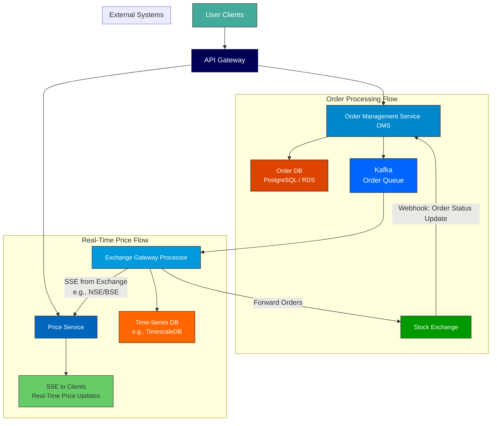

## Table of contents

# Introduction

In today’s fast-paced financial markets, stock broker platforms like Zerodha, Groww, and INDmoney serve millions of users who demand real-time data, instant order execution, and high reliability. Building such a system requires a deep understanding of distributed systems, real-time communication, data consistency, and scalability.

In this article, we’ll dissect a real-world system design interview where the candidate is tasked with designing a stock broker platform from scratch. We’ll walk through the key decisions, trade-offs, and architectural patterns used to build a robust, scalable, and low-latency system that can handle billions of requests per day while ensuring data integrity and user experience.

Whether you're preparing for a system design interview or building a fintech product, this breakdown will give you actionable insights into how to design for performance, consistency, and resilience.

# Functional and Non-Functional Requirements

The primary goal is to design a **stock broker platform** — not the stock exchange itself. The exchange (e.g., NSE, BSE) is assumed to exist and handle order matching, clearing, and settlement. Our system acts as the intermediary between users and the exchange.

### Functional Requirements:

- Users can **place buy/sell orders** (both market and limit orders).
- Users can **view real-time stock prices**.
- The platform must **forward orders to the exchange** and track their status.
- Maintain **user order history** locally for quick access and analytics.

### Non-Functional Requirements:

- **High consistency** for order placement — no lost trades, even at the cost of availability.
- **High availability** for price viewing — slight staleness (e.g., 10–30 seconds) is acceptable.
- **Scalability** to handle up to **2 billion daily requests**, with peak loads reaching **10 billion/day** (~115,000 QPS).
- **Low latency** in order submission and price updates.
- **Fault tolerance** and **reconciliation** mechanisms for order tracking.

Traffic assumptions:

- 100 million users → 10% DAU = 10 million daily active users.
- Each user checks 10 stocks, 20 times/day → 2 billion read requests/day.
- Buy/sell operations: ~10% of total → ~200 million/day (~2,000 QPS peak).

This makes the system **read-heavy**, especially on price data.

# High-Level Architecture Overview

The system is composed of several microservices and external integrations:



Key components:

- **API Gateway**: Central entry point for authentication, rate limiting, and request validation.
- **Price Service**: Serves real-time and historical stock prices to clients.
- **Order Management Service (OMS)**: Handles order creation, persistence, and forwarding.
- **Exchange Gateway Processor**: Manages all external communication with the stock exchange.
- **Time-Series DB**: Stores intraday stock price ticks (e.g., TimescaleDB).
- **Order DB**: Persistent, ACID-compliant database for order records (e.g., PostgreSQL).
- **Kafka**: Message queue for asynchronous order processing.
- **Webhooks**: Exchange notifies our system of order status changes.

# Real-Time Stock Price Distribution with SSE and Time-Series DB

### Why Not WebSockets?

Clients need real-time price updates, but **not two-way communication**. WebSockets would be overkill and resource-intensive, especially if a user monitors multiple stocks (each requiring a separate connection). Instead, **Server-Sent Events (SSE)** are used:

- **Lightweight**, HTTP-based.
- **Unidirectional push** from server to client.
- **Lower client-side overhead**.
- Easy to scale with HTTP/2 multiplexing.

### Architecture Flow:

1. The **Exchange Gateway Processor** subscribes to real-time price feeds from NSE/BSE via SSE.
2. Incoming price ticks are:
   - Stored in a **Time-Series Database** (e.g., **TimescaleDB**) for historical queries.
   - Pushed to the **Price Service** via a pub/sub mechanism (e.g., Redis Pub/Sub for low-latency push).
3. The **Price Service** broadcasts updates to subscribed clients via SSE.

### Handling New Users (Catch-Up Logic):

- When a user opens the app mid-session, they need **intraday historical data**.
- The Price Service queries the **Time-Series DB** for price ticks since market open (e.g., 9:15 AM).
- After loading history, SSE stream is established for real-time updates.

### Data Model (Time-Series DB):

```sql
Table: stock_price_history
- symbol: VARCHAR (e.g., INFY)
- timestamp: TIMESTAMPTZ
- price: DECIMAL
- volume: INTEGER

Index: (symbol, timestamp)
Partitioning: By time (daily or hourly chunks)
Sharding: By symbol (high-volume stocks on dedicated nodes)
```

# Order Management System and Asynchronous Processing

### Why Not Direct API Calls?

Directly forwarding orders to the exchange under high load risks:

- Overwhelming the exchange.
- Losing orders during failures.
- Poor user experience due to latency.

### Solution: Asynchronous Processing with Kafka

1. User submits order → **OMS** receives it via POST `/api/v1/order`.
2. OMS validates and persists the order in **Order DB** with status `PENDING`.
3. Order is published to **Kafka** for async processing.
4. **Exchange Gateway Processor** consumes from Kafka and forwards orders to the exchange.
5. Exchange returns an `exchange_order_id` → OMS updates the record.
6. Exchange sends **webhook** on status change (filled, rejected, canceled).

### Data Model (Order DB):

```sql
Table: orders
- order_id: UUID (Primary Key)
- user_id: UUID
- symbol: VARCHAR
- order_type: ENUM('BUY', 'SELL')
- price_type: ENUM('MARKET', 'LIMIT')
- limit_price: DECIMAL (nullable)
- quantity: INTEGER
- status: ENUM('PENDING', 'PLACED', 'FILLED', 'CANCELLED')
- exchange_order_id: VARCHAR (nullable)
- created_at: TIMESTAMPTZ
- updated_at: TIMESTAMPTZ
```

### Handling Failures:

- If no `exchange_order_id` is received after retries → move to **Dead Letter Queue (DLQ)**.
- Manual or automated reconciliation process handles DLQ orders.
- Background jobs periodically reconcile order statuses with the exchange.

# Scalability, Consistency, and Latency Optimizations

### 1. **Hybrid Scaling Strategy**

- **Auto-scaling** for general retail traffic.
- **Pre-provisioned (warm) servers** for institutional clients (hedge funds, algo traders).
- Ensures low latency for high-volume users.

### 2. **Co-Location with Exchange**

- Deploy servers in the **same data center** as the exchange.
- Use **direct leased lines** to reduce network latency.
- Critical for high-frequency trading clients.

### 3. **Smart Load Balancing**

- Route high-volume symbols (e.g., Reliance, TCS) to **dedicated price servers**.
- Use **larger EC2 instances** for high-traffic symbols.
- Avoid uniform load distribution — optimize for hot keys.

### 4. **Database Optimizations**

- **Order DB**: Sharded by `user_id`, indexed by `created_at` for fast history lookup.
- **Time-Series DB**: Partitioned by time and sharded by symbol.
- Use **read replicas** for price queries to offload the primary.

### 5. **Push-Based Internal Communication**

- Replace Kafka polling with **Redis Pub/Sub** or **gRPC streaming** for price updates.
- Enables **push model** from Exchange Gateway → Price Service → Clients.

# Handling Surge Traffic and Rate Limiting

During market open/close, traffic spikes dramatically. To manage this:

### 1. **Backpressure via Kafka**

- Orders are queued in Kafka.
- Exchange Gateway processes at a controlled rate.
- Prevents overwhelming the exchange.

### 2. **Rate Limiting at Gateway**

- API Gateway enforces per-user and per-IP rate limits.
- Priority tiers: Institutional > Retail > Free users.

### 3. **Tiered Data Freshness**

- **High-priority symbols** (Nifty 50): Real-time, low staleness.
- **Low-priority symbols**: Accept 30–60 sec delay.
- Reduces load on exchange subscriptions.

### 4. **Pre-Scaling for Known Peaks**

- Auto-scale up **15 minutes before market open**.
- Scale down post-market close.
- Cost-effective and responsive.

# Conclusion

Designing a stock broker platform is a complex but rewarding challenge that sits at the intersection of **real-time systems**, **financial integrity**, and **massive scale**. The key takeaways from this design are:

- **Separation of concerns**: Isolate price streaming from order management.
- **Event-driven architecture**: Use message queues and webhooks for resilience.
- **Right tool for the job**: SSE over WebSockets, Time-Series DB for ticks, RDBMS for orders.
- **Trade-offs matter**: Consistency for orders, availability for prices.
- **Latency is everything**: Co-location, push models, and pre-provisioned infrastructure make a difference.

This system not only handles the scale but also ensures that users can trade with confidence — knowing their orders won’t get lost and their data is accurate.

See you on the next post.

Sincerely,

**Eng. Adrian Beria.**
