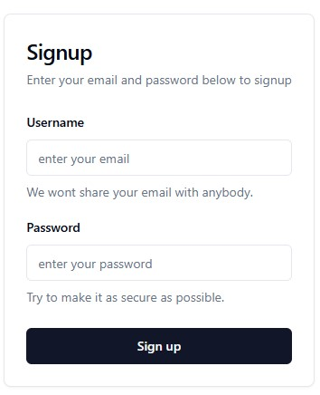

## Table of contents

## Introduction

Today we will start building a dashboard from scratch, not only using frontend tools but also building the api in the backend. Last post we start a simple crud application with bun, typescript and hono, we're gonna work using that as a base to make our dashboard. I'm not entirely sure what the business logic will be, but I want it to have the following:

- Login/Register form
- Public and private routes
- Home page will show all corresponding metrics in cards and stats with some charts made with recharts
- Analysis section with a table made with react
- Maps section made with react-leaflet

We're gonna make this like it's a real life job where we get tickets and make tasks out of them to prepare you better.

## Setup

- Go to https://github.com/brielov/react-app, and click `use template` then create the template in your Github, then clone it.
- Install shadcn `npx shadcn-ui@latest init`
- At the prompt commands do the following:

```bash
Would you like to use TypeScript? yes
Which style would you like to use? › Default
Which color would you like to use as base color? › Slate
Where is your global CSS file? › › src/main.css
Do you want to use CSS variables for colors? › yes
Where is your tailwind.config.js located? › tailwind.config.js
Configure the import alias for components: › @/components
Configure the import alias for utils: › @/lib/utils
Are you using React Server Components? › no
```

- Install react router:

```bash
npx install react-router-dom
```

- Install `react-hook-form` with `npm install react-hook-form`
- Install `zod` for input validation with `npm install zod`

## Auth task description

We're gonna create a form component for our login and register forms.

**Title**: Create an auth form component
**Description**:

- Use shadcn to build the component
- It should have two fields, `username` and `password`
- It should have a button with the text `Login` and `Register` for its respective uses
- It should have a prop to behave as `Login` or `Register`
- When user `login` it should take them to the `home` or `/`
- When user `registers` it should take them to the `login` or `/login`
- The route should be `/login` or `register`
- The routes should be public routes

### Use shadcn to build the component

Add form with `npx shadcn-ui@latest add form`, button with `npx shadcn-ui@latest add button`, card with `npx shadcn-ui@latest add card`, input with `npx shadcn-ui@latest add input`.

Create a folder inside `components` called `auth` and inside add `auth-form.tsx`.

We're gonna create a form inside a card, lets do the imports first:

```typescript
import {
  Form,
  FormControl,
  FormDescription,
  FormField,
  FormItem,
  FormLabel,
} from "@/components/ui/form";
import { z } from "zod";
import { useForm } from "react-hook-form";
import {
  Card,
  CardContent,
  CardDescription,
  CardFooter,
  CardHeader,
  CardTitle,
} from "@/components/ui/card";
import { zodResolver } from "@hookform/resolvers/zod";
import { Input } from "../ui/input";
import { Button } from "../ui/button";
```

Next let's add the formSchema to validate our inputs:

```typescript
const formSchema = z.object({
  username: z.string().trim().toLowerCase().email(),
  password: z.string().min(8).max(255),
});

export type FormValues = z.infer<typeof formSchema>;
```

The idea of the formSchema is to define the expected structure and data types for your form inputs. This ensures that only valid data gets submitted to your application, preventing unexpected errors or security vulnerabilities.

To get the type we use zod type inference capabilities in TypeScript to extract the type information from your formSchema.

Next we create our `AuthForm` component:

```typescript
const AuthForm = () => {
  const form = useForm<FormValues>({
    resolver: zodResolver(formSchema),
    defaultValues: {
      username: "",
      password: "",
    },
  });
  return <Form {...form}></Form>;
};
```

The `form` object manages the state and behavior of your form, while the `resolver` is you're essentially telling React Hook Form to use Zod to validate the form data based on the rules defined in your formSchema.

Now let's add the rest of the components inside our form:

```javascript
const AuthForm = (props: Props) => {
  const form =
    useForm <
    FormValues >
    {
      resolver: zodResolver(formSchema),
      defaultValues: {
        username: "",
        password: "",
      },
    };
  return (
    <Form {...form}>
      <form onSubmit={form.handleSubmit(props.onSubmit)}>
        <fieldset>
          <Card className="w-full max-w-sm">
            <CardHeader>
              <CardTitle className="text-2xl">Signup</CardTitle>
              <CardDescription>
                Enter your data below to signup.
              </CardDescription>
            </CardHeader>
            <CardContent className="grid gap-4">
              <FormField
                control={form.control}
                name="username"
                render={({ field }) => (
                  <FormItem>
                    <FormLabel>Username</FormLabel>
                    <FormControl>
                      <Input
                        type="email"
                        placeholder="enter email"
                        {...field}
                      />
                    </FormControl>
                    <FormDescription>
                      We wont share your email with anybody.
                    </FormDescription>
                    <FormMessage />
                  </FormItem>
                )}
              />

              <FormField
                control={form.control}
                name="password"
                render={({ field }) => (
                  <FormItem>
                    <FormLabel>Password</FormLabel>
                    <FormControl>
                      <Input
                        type="password"
                        placeholder="enter password"
                        {...field}
                      />
                    </FormControl>
                    <FormDescription>
                      Try to make it as secure as possible.
                    </FormDescription>
                    <FormMessage />
                  </FormItem>
                )}
              />
            </CardContent>
            <CardFooter>
              <Button type="submit" className="w-full">
                Sign up
              </Button>
            </CardFooter>
          </Card>
        </fieldset>
      </form>
    </Form>
  );
};
```

We added some tailwind classnames to make it look better and a `onSubmit` prop.

The pattern is basically use the `Form` from our components folder which will wrap a common `HTML form` and inside we will show a card which will have a header and a body, where inside the body we put our form fields for `username` and `password`, where each will render an item which wraps a Label, the Input component and a description.

## Routes

Create a folder called `routes` and inside add a file called `signup.tsx`.

```javascript
import { z } from "zod";
import AuthForm from "@/components/auth/auth-form";

const formSchema = z.object({
  username: z.string().trim().toLowerCase().email(),
  password: z.string().min(8).max(255),
});

type FormValues = z.infer<typeof formSchema>;

export default function SignupRoute() {
  function onSubmit(values: FormValues) {
    console.log("Succesfully registed", values.username);
  }

  return (
    <div className="min-h-screen flex items-center justify-center px-4">
      <AuthForm onSubmit={onSubmit} />
    </div>
  );
}
```

We will add its respective functionalities later on. For now lets add the following inside our `app.tsx` file:

```javascript
import { Route, Routes } from "react-router-dom";
import SignupRoute from "./routes/signup";

export default function App() {
  return (
    <Routes>
      <Route path="/signup" element={<SignupRoute />} />
      <Route path="/" element={<div>Hello</div>} />
    </Routes>
  );
}
```

And in `main.tsx`:

```javascript
import { StrictMode, Suspense } from "react";
import { createRoot } from "react-dom/client";
import { BrowserRouter } from "react-router-dom";
import "./main.css";
import App from "./app.tsx";

const rootNode = document.getElementById("root")!;

rootNode &&
  createRoot(rootNode).render(
    <StrictMode>
      <Suspense fallback="Loading...">
        <BrowserRouter>
          <App />
        </BrowserRouter>
      </Suspense>
    </StrictMode>,
  );
```

Finally run `npm run dev` and go to `/signup` to see:



## Conclusion

We succesfully set the project and made our first component! We need to make it better but its a good start and didn't want to make it longer. We need to make it behave differently for when its login or register since its basically the same component, but we will do that on the next one.

See you on the next post.

Sincerely,

**Eng. Adrian Beria.**
